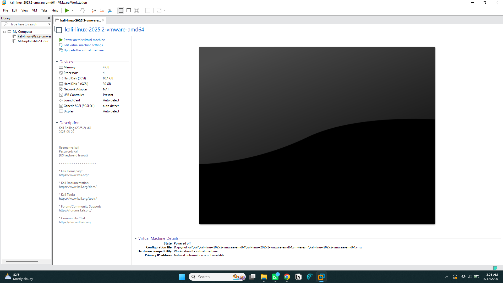
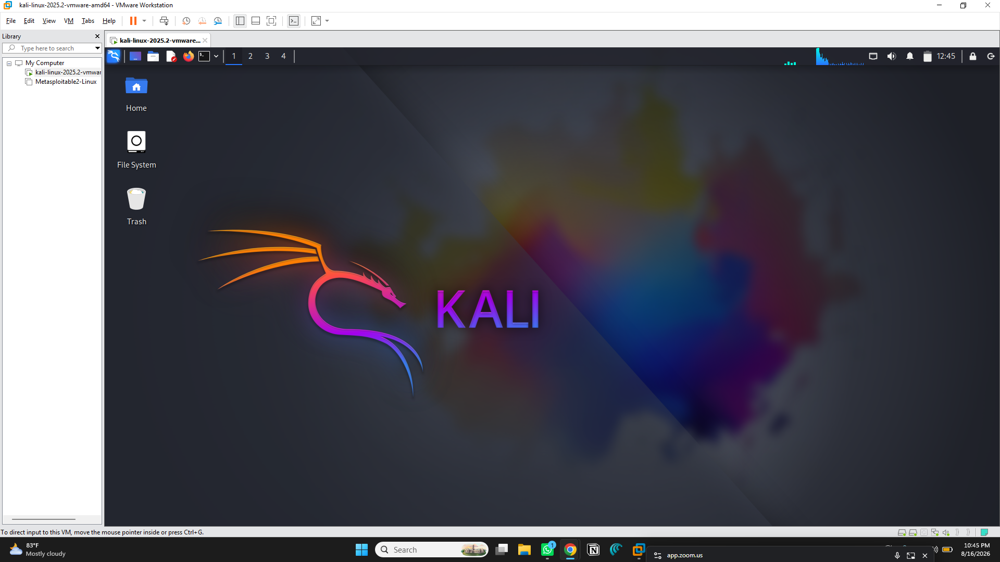
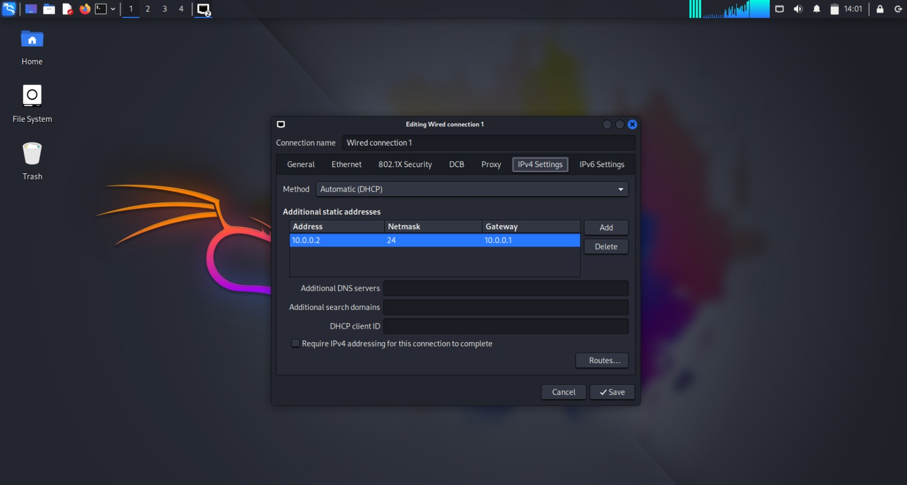
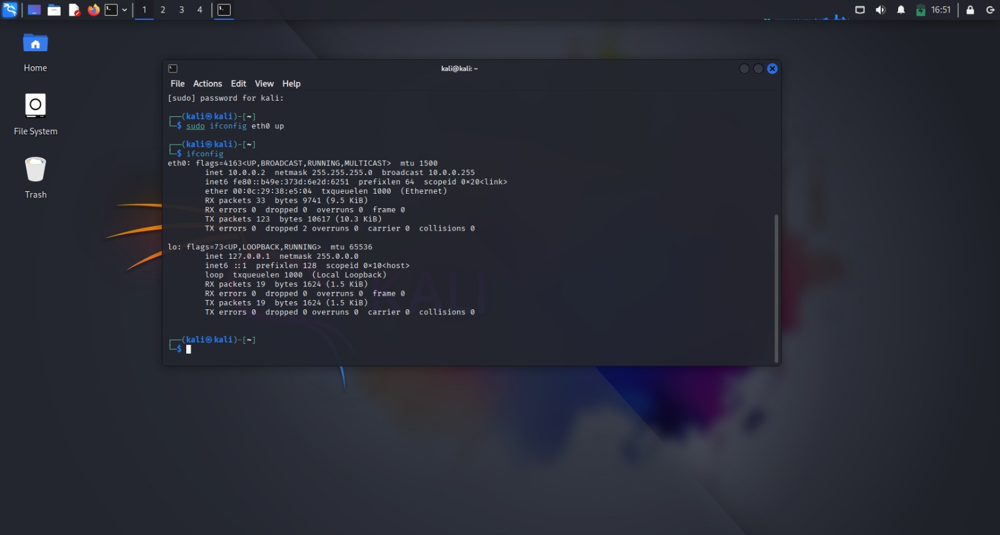

# Networkwalks-Batch-B082-Week-1-CybersecurityLab-Setup-
Cybersecurity Lab Setup 
# 🔐 Cybersecurity & Pentesting Lab Setup


## 📌 Project Overview

This repository contains my **Week 1 Cybersecurity Lab Setup project** completed as part of the **Cybersecurity Program at NETWORKWALKS (Batch B082)**.

The objective of this project was to build a safe and isolated virtual environment for practicing cybersecurity, networking, and penetration testing techniques.

The lab was created using **VMware Workstation and Kali Linux**.

---

## 🎯 Objectives

The main objectives of this project were:

* Set up a virtual cybersecurity laboratory
* Install and configure Kali Linux
* Understand VMware virtual networking
* Configure a private NAT network
* Verify IP addressing and network connectivity
* Test DNS resolution
* Create a recovery snapshot
* Document the complete lab setup

---

## 🛠️ Technologies & Tools

| Tool               | Purpose                                |
| ------------------ | -------------------------------------- |
| VMware Workstation | Virtualization                         |
| Kali Linux         | Security testing / penetration testing |
| NAT Network        | Virtual network connectivity           |
| Linux Terminal     | Network testing                        |
| GitHub             | Project documentation                  |

---

## 🏗️ Lab Architecture

```text
                    Internet
                       │
                       │
                Host Computer
                       │
                VMware Workstation
                       │
                  NAT Network
                       │
                ┌──────┴──────┐
                │             │
          Kali Linux VM    Future VMs
          Security Lab      (Planned)
```

The virtual network provides an isolated environment where cybersecurity tools and testing activities can be performed safely.

---

# 🔧 Lab Setup

## 1. VMware Workstation Setup

VMware Workstation was installed and configured as the virtualization platform for the cybersecurity lab.

VMware Workstation: https://www.vmware.com/products/desktop-hypervisor/workstation-and-fusion



---

## 2. Kali Linux Installation

Kali Linux was installed as the primary security testing machine.

Kali Linux provides a wide range of tools for:

* Network analysis
* Vulnerability assessment
* Penetration testing
* Digital forensics
* Security testing
  
Kali Linux: https://kali.org/get-kali



---

## 3. NAT Network Configuration

A custom NAT network was configured in VMware to provide network connectivity to the virtual machine while keeping the lab environment separated from the physical network.




---

## 4. IP Configuration

After configuring the network, Kali Linux was checked to verify its assigned IP address, subnet information, and gateway.

Command used:

```bash
ip addr
```

Routing information was checked using:

```bash
ip route
```




---

## 5. Network Connectivity Test

Internet connectivity was tested using:

```bash
ping -c 4 8.8.8.8
```

Successful responses confirmed that the Kali Linux VM could communicate through the configured NAT network.


## 7. VM Snapshot

After completing the configuration, a clean VMware snapshot was created.

The snapshot provides a recovery point that can be restored if future penetration testing activities change or damage the virtual machine configuration.

---

# 📚 What I Learned

During this project, I gained practical experience with:

* VMware virtualization
* Kali Linux installation and configuration
* NAT networking
* IP addressing
* Default gateways
* DNS resolution
* Linux network troubleshooting
* Virtual machine snapshots
* Cybersecurity lab design
* Technical documentation

---

# 🔮 Future Plans

This lab will be expanded in future projects.

Planned additions include:

* 🖥️ Windows target machine
* 🐧 Additional Linux machines
* 🎯 Vulnerable machines
* 🔎 Network scanning
* 🛡️ Vulnerability assessment
* 🧪 Penetration testing exercises
* 📊 Security monitoring
* 🔐 SOC-related labs

---

# 📸 Project Screenshots

All important screenshots from the project are available in the [`screenshots`](screenshots/) directory.

---

# 🎥 Lab Demonstration

A short video demonstrating the completed cybersecurity lab is available with the project submission.

---

# 👨‍💻 Author

**Joynul Hasan**

Cybersecurity Student | Aspiring Cybersecurity / SOC Professional

---

## 🙏 Acknowledgment

Special thanks to **Sir Waqas Karim (CCIE)** and the **NETWORKWALKS** team for their guidance, support, and practical learning opportunities.

---

⭐ If you find this project useful, feel free to explore the repository and follow my cybersecurity learning journey.
